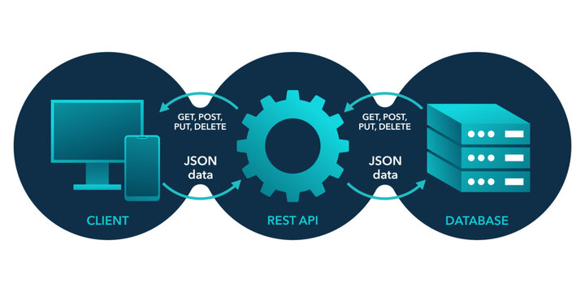

# PROJETO INTEGRADO STACKX

---

### <div align="center">

# 

### [Clique aqui para acessar o Projeto `Em json-server`](https://projetointegrado-backend-server.onrender.com/)

  <br>

---

# Suas Aplicações:
  
  


---
#  Ferramenta Do Desafio⁉


---
##  &nbsp;Linguagem Tecnológica do Desafio:


---
# Passo a Passo do Projeto:

### Vai criar a pasta com o nome `burgerplace-backend`;

---
### No `VsCode` instalando dependências:

```
npm init –y
```
 Realiza a instalação do pacote `package.json`.

<br>

```
   npm install axios
```
  Axios é um cliente HTTP baseado-em promessas para o node.js e para o navegador.

<br>

```
   npm i json-server --save
```
 Instalando o servidor `json` para iniciar a partir do banco de dados `db.json`.

---

### Após vai no package.json `scripts`, vai em `start` e digita da seguinte forma👇

```
   {
  "start": `node server.js`
},
```

---

### Executar o projeto no servidor:

```
json-server db.json –watch`
```
 para rodar na porta: `http://localhost:3000/`


---
####  Testes com as ferramentas🚀


<br>


---

   - ##  Autor

<p>
    
    <p>&nbsp&nbsp&nbspRafaRz76Dev<br>
    &nbsp&nbsp&nbsp<a href="https://api.whatsapp.com/send/?phone=47999327137">Whatsapp</a>&nbsp;|&nbsp;<a href="https://www.linkedin.com/in/rafael-raizer//">LinkedIn</a>&nbsp;|&nbsp;<a href="https://github.com/RafaRz76Dev">GitHub</a>|&nbsp;<a href="https://public.tableau.com/app/profile/rafael.raizer">Tableau</a>|&nbsp;<a href="https://portifolio-rafarz76dev.netlify.app/">Portfólio</a>&nbsp;</p>
</p>

